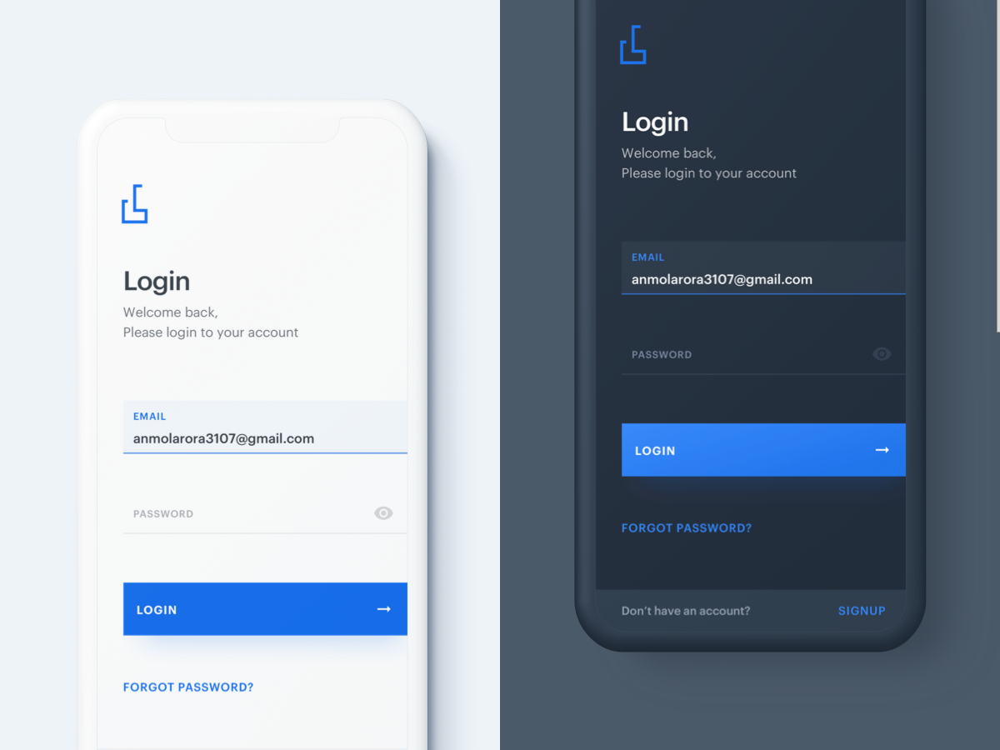

This app is part of a collection of apps that I developed in Flutter with the purpose of mastering the necessary skills for implementing custom UI/UX designs in Android and iOS.

You can find the entire collection of apps in [this blog post](https://dev.to/crivasgomez/flutter-uiux-design-implementations-518i) and all the source code in [this GitHub repository](https://github.com/CRivasGomez/flutter-ui-ux-designs).

## Minimal Login

### [Original design](https://www.uplabs.com/posts/minimal-login-light-dark-version) by [Anmol Arora](https://www.uplabs.com/anmol3107):

### iOS demo:

### Android demo:

